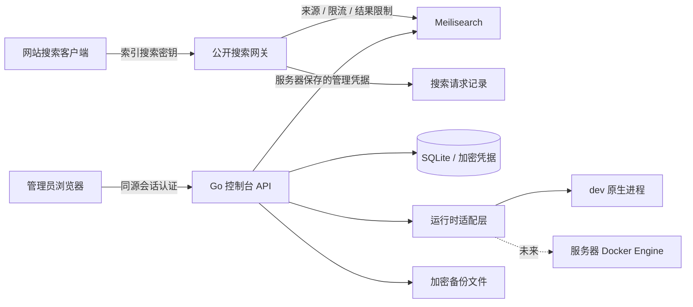
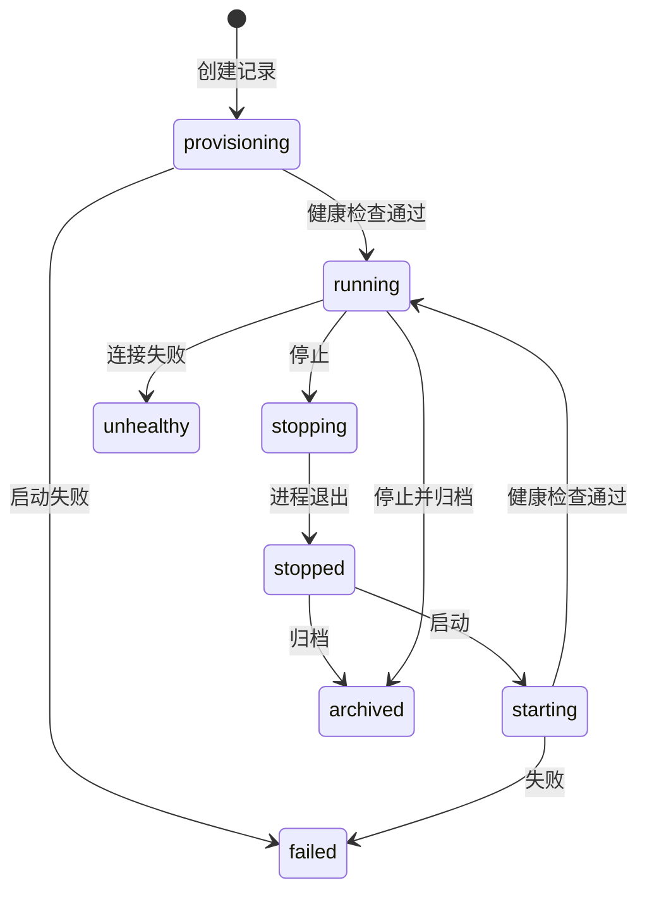
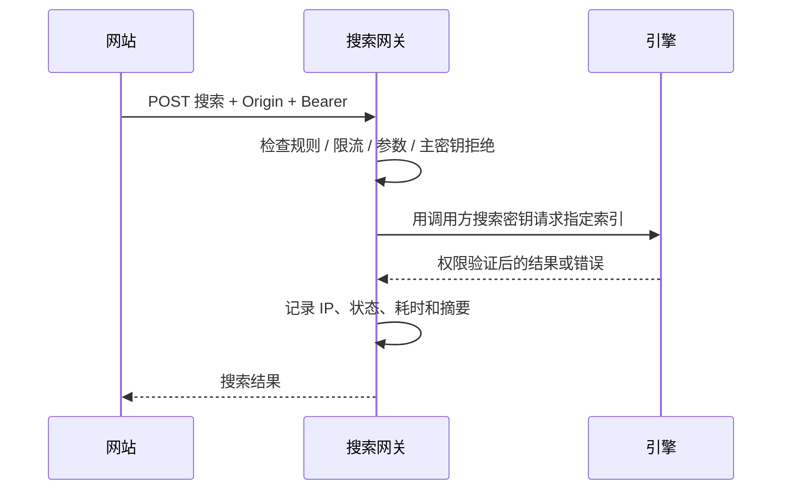

# OneSearch 系统设计

> 部署更新：服务器 Docker 运行时、同端口前端服务、HTTPS Cookie 和可信代理已实现，配置与当前限制见 [服务器部署](deployment.md)。以下早期调研与演进方案中未完成项目，以部署文档为准。
版本：dev 0.1，2026-10-03。前端 Moment 风格，后端 Go，最终服务器 Docker。本文中“已实现”指当前 dev；Docker、线上恢复及多用户模块是后续设计。

## 1. 架构与信任边界

管理 API 与公开搜索 API 分离。管理 Cookie 不授予公开搜索权限；公开入口必须有 Bearer 搜索密钥。引擎管理凭据只在后端解密使用。浏览器拿到的实例对象不含主密钥和进程 PID。

生产建议单域名同源部署管理前端/API，由反向代理提供 HTTPS。公开搜索 API 可以跨域，精确白名单按索引配置。引擎原生端口和 Docker socket 不公开。

## 2. 技术栈和目录

| 部分 | 当前选择 | 理由 |
| --- | --- | --- |
| 前端 | React 19、Mantine 8、React Router、TanStack Query、Vite | 与 Moment 体系一致，支持独立 dev 和按页加载 |
| API | Go 1.26，net/http ServeMux | 接口范围清晰，便于运行时与协议测试 |
| 平台数据库 | modernc SQLite，WAL，单连接 | 本地部署简单，平台数据一致性明确 |
| 密码 | bcrypt | 服务端单向哈希，限制密码字节数 |
| 通行密钥 | go-webauthn 0.18.2 | 由协议库验证，而非前端自行判断 |
| 凭据加密 | AES-256-GCM | 管理密钥与 TOTP 秘密静态加密 |
| 备份加密 | scrypt + AES-256-GCM | 每份随机盐/nonce，认证解密检测损坏 |

`cmd/onesearch` 为 API 入口；`internal/console` 包含数据库、账户、运行时、网关和备份；`web/src` 为前端；`cmd/backup-extract` 为离线解密工具；`scripts/dev-smoke.py` 为真实实例验证脚本。

运行数据均在 `data/`：数据库、加密密钥、托管实例数据和备份。禁止提交到版本库。

## 3. 页面结构与 Moment 迁移

全局侧栏：工作台、可折叠的搜索实例树、备份、账户设置。移除只展示运行信息的平台设置页面和工作空间 DEV 标签。实例树列出实例及索引，点击索引直接进入文档页。底部使用 Moment 的浅色/深色/系统分段切换和头像账户菜单；账户菜单提供“账户设置”“退出登录”。

账户设置：左侧分项导航、右侧内容卡片。分项为账户资料、登录安全、修改密码、登录会话、审计日志。去掉审计日志的重复大标题。dev 账户资料只展示真实用户名，不提供没有后端支持的虚构资料字段。

实例详情：页头名称/状态/生命周期操作，紧凑元数据卡片；内部左侧导航分为统计、操作记录、搜索历史、索引、文档与搜索、搜索设置、站点访问、索引任务、访问密钥、运行日志。页头名称旁统一选择索引，以 URL 的 view/index 参数保留当前页面与索引。历史、索引任务、访问密钥按选中索引展示；统计为整个实例的请求统计。索引列表提供文档与设置快捷入口。

文档列表使用 limit/offset 分页；搜索使用 page/hitsPerPage 并显示 totalHits/totalPages，结果数仍受引擎 maxTotalHits 限制。返回 _formatted、_matchesPosition 与相关性分数，控制台以文本和受控标记渲染高亮，避免执行文档 HTML。运行日志进入时自动定位末尾，位于底部时跟随更新，向上浏览则暂停跟随。

工作台采用 GitHub Calendar 风格的每日请求热力图，按 UTC 日期汇总真实请求。实例统计提供近 7/30 天请求量、成功率、平均耗时、IP、请求趋势和热门搜索词。每日聚合独立保留 400 天，原始请求保留 30 天；记录开始前显示未记录，不制造历史活动。

迁移的设计基础包括：victoria 主题色、输入框背景与焦点环、标签间距、圆角、菜单和弹窗动效、主题分段组件、通用分段选项、Toggle 原始组件及账户导航。原生滚动容器和 Mantine ScrollArea 统一为 8px 圆角滚动条，迁移 Moment 的深浅色、悬停样式和 Chromium/Firefox 兼容规则。只迁移 UI 所需实现；不修改 Moment 工作区。

页面不放宣传语、没有实际价值的默认描述或营销卡片。保留错误、操作影响、备份范围及必要权限说明。网络请求有加载、错误、重试和空状态。

## 4. 实例生命周期

实例模型：名称、描述、provider、host、端口、索引预算、线程、status、desiredState、版本、错误、创建时间以及加密保存的 Secret。

当前生命周期操作写入 Operation 后由单工作线程执行，返回 202；只有健康检查通过才显示运行中。失败记录错误并允许明确重试。重启后台时中断的排队/执行任务记为失败，不自动重放。

dev 端口来自固定范围 7810–7899，实际监听与平台记录均检查冲突。数据目录由实例 ID 生成。浏览器不能提供执行文件或路径。停止操作只作用于本次后台拥有的进程，不根据历史 PID 杀进程。

正常关闭后台会停止其托管进程，重新启动后可在 UI 启动保留的实例。强制结束后台可能留下原生进程：可以继续管理索引，但平台不会冒险停止不归本次后台管理的 PID，需先处理旧进程。服务器 Docker runtime 将通过容器 ID、平台标签和状态协调消除此开发限制。

外部接入 dev 只允许显式本机 HTTP 地址与端口，禁用重定向。外部服务可归档连接记录，但平台不停止其服务。服务器接入任意远程地址前须引入 DNS/IP 校验、内网目标策略和出站限制，避免 SSRF。

## 5. 数据模型

| 表 | 主键与主要数据 | 安全要求 |
| --- | --- | --- |
| instances | ID、元数据 JSON、加密 Secret | API 输出删除 Secret/PID |
| operations | ID、实例、动作、状态、时间、消息 | 当前最近 100 条展示，重启不重放 |
| users | username、password_hash | 不返回哈希 |
| sessions | token_hash、用户、有效期 | 存哈希，不存 Cookie 明文 |
| session_details | token_hash、IP、UA、时间、验证时间、方式 | 撤销授权以 sessions 为准 |
| security | 用户、加密 TOTP/pending、时间步、恢复码哈希 | 秘密仅设置时给用户，恢复码单次消费 |
| passkeys | 凭据 ID、用户、RP、协议凭据、名称、时间 | 不保存设备私钥 |
| passkey_challenges | token_hash、用户、类型、会话绑定、过期 | 完成时原子消费 |
| site_policies | 实例 + 索引、规则 JSON | 默认公开入口关闭 |
| search_history | ID、实例、索引、查询、IP、状态、时间、详情 JSON | 默认 30 天保留，无授权头及结果正文 |
| audit | ID、操作者、动作、目标、时间 | 保存稳定代码，前端中文显示 |
| daily_metrics / metrics_meta | 每日实例/来源请求聚合、记录起始日期 | 原始历史清理后保留聚合，400 天 |
| backups | ID、类型、状态、时间、大小、SHA-256、错误 | 文件名由平台生成，不含密码 |

SQLite 单连接减少当前 dev 的竞态复杂度；大量搜索历史写入不宜与控制平面长期竞争。服务器阶段考虑独立写入队列、批量提交和独立日志存储，控制丢失率与背压。

## 6. 接口设计

管理成功响应 `{data: ...}`；失败 `{error: {message: ...}}`。引擎删除密钥可能返回 204，客户端需接受无响应体。公开搜索保持 Meilisearch 的搜索响应结构，便于网站集成。

| 接口组 | 方法/路径 | 行为 |
| --- | --- | --- |
| 会话 | POST `/api/auth/login`、GET `/api/auth/me`、POST `/api/auth/logout` | 密码+可选第二因素、当前账户、退出 |
| 重新验证 | POST `/api/auth/reauth` | 密码和已启用的第二因素，5 分钟敏感操作窗口 |
| 修改密码 | POST `/api/account/password` | 当前密码、OTP、新密码；轮换会话 |
| 通行密钥 | POST `/api/auth/passkey/begin`、`finish` | 登录挑战和验证 |
| 通行密钥管理 | GET `/api/passkeys`、POST `begin`/`finish`、DELETE `/{key}` | 注册、列表、删除 |
| TOTP | GET `/api/security`、POST `/api/security/totp/begin`/`confirm`/`disable` | 状态、设置、启用和关闭 |
| 登录会话 | GET `/api/sessions`、DELETE `/{session}` 或 `/others` | 当前用户会话、撤销 |
| 实例 | GET/POST `/api/instances`、GET `/{id}`、POST `/{id}/actions` | 创建和生命周期 |
| 引擎管理 | `/api/instances/{id}/engine/{path}` | 白名单路由，不提供任意代理 |
| 网站规则 | GET/PUT `/api/instances/{id}/sites/{index}` | 来源、公开开关、频率、结果上限 |
| 网站搜索 | POST/OPTIONS `/api/search/{id}/{index}` | Bearer 密钥、来源检查、搜索和预检 |
| 统计 | GET `/api/calendar`、`/api/instances/{id}/analytics` | 年度日历、实例 7/30 天统计 |
| 实例操作 | GET `/api/instances/{id}/operations` | 当前实例最近 100 条生命周期操作 |
| 历史 | GET `/api/history` | instance/index/q/source/offset 筛选，50 条分页 |
| 备份 | GET/POST `/api/backups`、GET `/{backup}/download` | 手动加密备份、状态和下载 |
| 操作/审计 | GET `/api/operations`、`/api/audit` | 最近记录 |

管理引擎代理只开放已实现的 indexes/documents/search/settings/tasks/keys/stats/version 操作。无任意 URL、宿主机文件操作或 Docker API 透传。限制请求体和上游响应体；错误中的主密钥脱敏。

## 7. 公开搜索规则

默认禁用，管理员按索引开启。来源规则使用精确 scheme/host/port，不接受路径、用户信息或泛域名。要求来源时无 Origin/Referer 的请求拒绝；管理员可以允许无来源的服务器调用。

OPTIONS 只对获准来源返回 CORS 许可。公开请求不使用 Cookie，也不设置 Allow-Credentials。密钥传在 Authorization，禁止放 URL。

限制：64 KiB 请求体、搜索参数白名单、每 IP 每索引频率、1–100 最大结果数；limit 与 hitsPerPage 均受上限约束，不允许通过分页参数绕过。公开入口默认请求高亮摘要与命中位置，可显式调整格式参数，结果仍遵守 displayedAttributes。默认 60 次/分钟、最多 50 个结果。当前内存限流窗口一分钟，重启归零，不是跨节点全局配额。

来源头不是身份凭证；密钥的索引权限由引擎判断。生产必须阻止网站直接访问原生端口，否则规则与历史无法覆盖全部请求。dev 使用连接 IP，不信任任意 X-Forwarded-For；反向代理生产版本须按配置的可信网段从右往左解析转发链，不能照抄客户端头。

## 8. 账户安全与审计

会话为随机不透明 Token，Cookie HttpOnly、SameSite=Strict。dev 仅本机 HTTP，生产 HTTPS 必须开启 Secure。24 小时过期；请求更新活跃时间。每次请求查询服务端会话，撤销即时生效。

密码首次最少 12 字节；修改密码限制 12–72 字节以匹配 bcrypt。密码登录和验证限制尝试次数；密码变更校验当前哈希一致以避免并发覆盖，撤销其他会话、认证挑战，旋转当前会话并删除初始明文登录文件。

TOTP 秘密静态加密，设置暂存 5 分钟；确认成功才启用。时间步原子递增，不能重复使用。恢复码随机生成 8 个，服务端只保存哈希，原子单次消费，前端仅首次展示。

开发环境 WebAuthn RP 为 localhost，精确 Origin 为 `http://localhost:5178`；生产环境使用配置的 HTTPS Origin。注册要求已登录会话与设备用户验证，不要求再次输入密码；挑战绑定当前登录会话。删除通行密钥、TOTP 设置与备份创建仍要求近期验证，前端按操作自动弹窗并在验证后继续，未开启 TOTP 时不展示验证码输入。密码登录只有在密码验证成功后才提示第二步；未完成第二步不创建会话。挑战完成时消费，不能重复使用。验证设备用户存在及用户验证，并更新凭据计数器；可疑克隆拒绝。真实认证器体验需要用户验证，自动测试不会替用户注册 Windows Hello。

审计底层保留事件代码，中文标签在 UI 映射。实例目标显示实例名，通用目标显示“账户”“管理后台”等。当前覆盖成功登录/退出、实例动作、索引变更、凭据变更、规则、备份及会话撤销；完整登录失败审计、请求 ID、不可变存储后续补充。

## 9. 备份文件与恢复

平台备份用 SQLite `VACUUM INTO` 生成一致副本，再移除 sessions/session_details/passkey_challenges。包含数据库、凭据加密密钥和 manifest，不包含搜索数据、初始密码文本或后台可执行文件。

数据备份触发引擎 `/dumps`，等待任务成功后读取平台托管目录的 dump；不在线复制运行中的 LMDB。外部接入服务暂不提供平台下载其宿主机文件的功能。

文件格式：10 字节 `ONESEARCH1` 标识、16 字节随机盐、12 字节随机 nonce、AES-GCM 密文与认证标签。scrypt 参数 N=32768、r=8、p=1，派生 32 字节密钥。头部作为附加认证数据。内部 ZIP 使用确定的允许文件名。手动备份密码仅本次任务内存使用；自动备份密码通过平台密钥加密后存储，不返回前端、不写入日志。

每日备份计划使用 `backup_schedule` 持久化北京时间、成功备份保留数、是否包含实例 dump、加密密码及最近执行日期。后台每 30 秒检查，使用原子更新认领当天执行，重启不重复执行。平台配置和各运行中的托管实例分别备份、分别保留；失败记录另按相同数量保留，手动记录及文件不清理。加密文件写入成功后清理本次生成的明文 dump。启动时中断的任务标记失败。当前调度为单机每日任务，不包含异地存储。

解密工具拒绝路径穿越、重复条目、不认识的文件名和过大的条目，输出使用排他创建，防止覆盖现有文件。平台恢复需人工先停后台、验证清单并备份当前目录，把解密出的数据库和对应加密密钥作为一组安装；恢复后重新登录。配置了外部加密密钥时必须改为备份对应密钥。

dump 恢复使用全新数据库目录与 `--import-dump`，待重建完成、验证文档/搜索/密钥权限后接入。不能把 dump 当作平台数据库。在线一键恢复、原子切流、快照和定时异地副本目前为后续阶段。

当前备份整份归档在内存完成，只适合小型 dev 数据；服务器阶段需流式加密、容量检查、进度和限流，避免大备份耗尽内存。

## 10. Docker runtime 后续设计

引入 Runtime 接口：Version、Create、Start、Stop、Inspect、Logs、Backup、RemoveMetadata。Native 与 Docker 实现共用领域操作，业务接口不接收 Docker 原始参数。

Docker 参数由后端生成：固定白名单镜像 `getmeili/meilisearch:<version>`，平台生成容器名/labels/卷名，独立网络，内存与 CPU 硬限制，索引预算作为另一参数。不接收任意 bind mount、命令、privileged 或 host network。镜像来源参见 [官方 Docker 部署](https://www.meilisearch.com/docs/resources/self_hosting/getting_started/docker)。

控制台访问 Docker socket 具有高权限，部署时应限定到专门的控制服务或代理，并最小化宿主机暴露。启动后定期 Inspect，区分 desiredState 和 observedState，容器 ID 与平台标签同时匹配。持久化操作幂等键、失败重试策略和对账，避免重复容器或误删除。

生产实例归档与删除分离：归档保留卷；删除需要明确显示影响、可恢复期和备份状态。当前不提供硬删除实例卷的按钮。

## 11. 开发到生产的阶段

1. 当前 dev：原生实例、实际索引、网关、账户安全、备份、Moment 风格管理界面。
2. Docker：容器适配、资源限制、状态协调、内部网络、Linux 文件权限、健康监控。
3. 生产安全：HTTPS/Secure Cookie、正式 RP、可信代理、网关密钥强化、多用户角色、完整失败审计。
4. 运维：计划备份、异地存储、容量与保留、恢复演练、版本升级及回滚。
5. 扩展：自动发布同步、抓取器、索引切换、请求聚合与告警。

上线条件不能只看界面：必须验证 Docker 生命周期、反向代理 IP、HTTPS WebAuthn、备份恢复和受限网络端口。当前 dev 不应直接对公网开放。
